# 👋 Hi, I'm Clarence Chen

🎓 CS Student | 🤖 AI | 🧠 LLM | ⚙️ Systems

---

## 🚀 About Me

* 🔭 Working on: LLM-based Applications & AI Agents
* 🌱 Learning: Agent Design, Tool Use, RAG Systems
* 💡 Interests: AI Systems, Autonomous Agents, Applied LLMs

---

## 🛠 Tech Stack

---

## 📈 GitHub Summary

<table>
<tr>
<td>

</td>
<td>

</td>
</tr>
</table>

 

  

---

## 🌟 Featured Projects

---

## 📫 Contact

* Email: [your_email@gmail.com](mailto:your_email@gmail.com)
